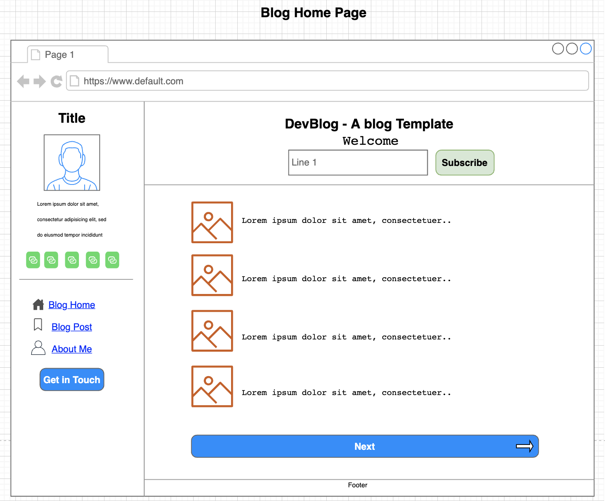
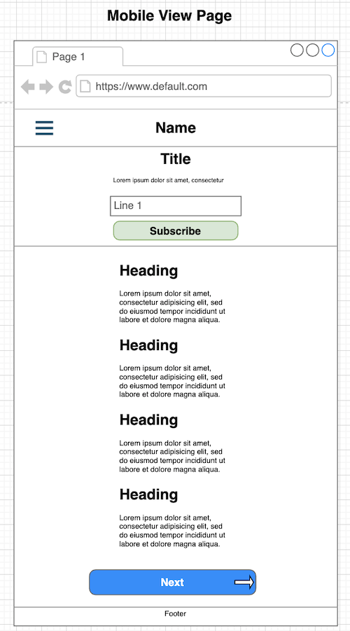

# personal_website
Personal Portfolio

_____________________________________________

##### User Stories:
1. As a junior web developer. We want to build a personal website to show my personal information and web projects. This is serve as personal blog of your work as a web developer.

2. As a software engineer. We always want to create something just to enhanced our skill in technology. It's a great idea to create a site as a container of all projects.

_____________________________________________

##### Wireframes:
1. Desktop View

2. Mobile View

_____________________________________________

##### Project URL: https://santiagoelie.github.io/personal_website

_____________________________________________

##### Name: Eliezer Santiago
##### Overview/Description of Project: The main purpose of this project is to create a website for personal portfolio. To show case what is all about you and the projects you've done.
##### Details: Personal website or personal portfolio.
##### Technologies used: HTML, CSS/SASS, JavaScript/jQuery.
##### Future Improvements:
1. By using Bootstrap, I want to learn more other technics and design built in bootstrap. It's a great framework because it gives me the ability to create a website like this portfolio fast and responsiveness. 

2. And also I want to enhance my design skill. To build a great design for any web app, I created. Like this portfolio. I want to try other design that has a more animation or to integrate interactive site.

3. By learning and creating web application. I also want to try other frameworks, that gives the ability to write less. And do more with the pre-built code.
